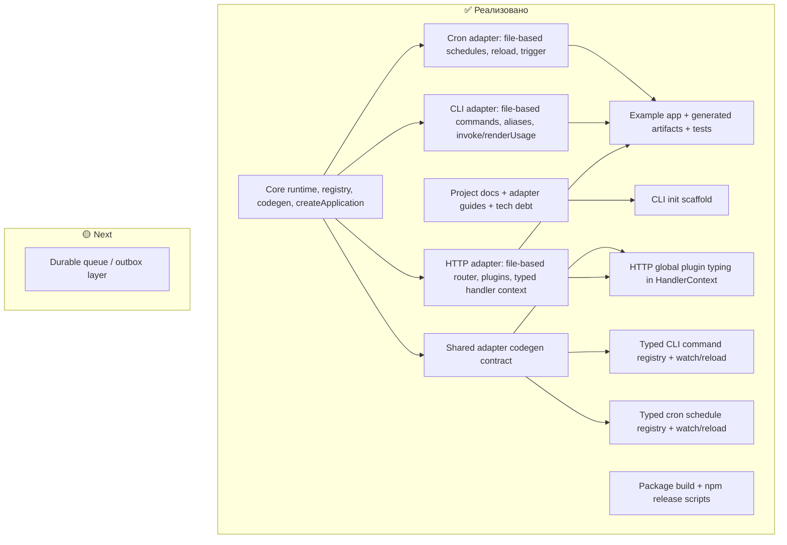

# Roadmap

Этот документ показывает две вещи одновременно:

- что уже реализовано в проекте;
- что ещё нужно сделать и в каком приоритете это логично брать.

`docs/TECH_DEBT.md` остаётся источником подтверждённых ограничений.
`docs/ROADMAP.md` — это уже рабочий план развития поверх этого backlog.

## Legend

- `✅ Done` — реализовано и уже есть в коде/тестах
- `🟡 Next` — подтверждённая задача, которую имеет смысл брать следующей

## Scheme

## Done

### Core

- `@orria-labs/runtime` покрывает declaration helpers, discovery, registry, runtime, `createApplication`, typed database adapter helpers и codegen для `src/generated/core`.
- CLI `orria-runtime generate` работает и генерирует core artifacts, плюс вызывает общий adapter codegen contract.
- CLI `orria-runtime init` создаёт минимальный scaffold проекта с выбором transport adapters.
- `createApplication(...)` выводит bus-типы из generated `manifest` и не требует явного `createApplication<...>()` в bootstrap.
- Runtime валидирует manifest conflicts и workflow subscriptions.

### HTTP adapter

- Реализован file-based router discovery из `src/transport/http/router`.
- Реализованы file-based plugins из `src/transport/http/plugins`.
- `defineHandler<...>()({...})` даёт typed route context с инференцией `body/query/params` из `options`.
- Поддержаны string plugin refs через generated `src/generated/http/plugin-registry.d.ts`.
- Поддержаны global и route-level plugins на runtime уровне.
- `defineHttpAdapter(...)` позволяет экспортировать `adapter` и typed `defineHandler` из одного bootstrap файла.
- `createHandlerFactory(...)` остаётся доступным low-level helper для кастомных abstractions.
- Adapter поддерживает `reload()`, `watch()` и `unwatch()` для routes/plugins.

### CLI adapter

- Реализован file-based command discovery из `src/transport/cli/command`.
- Работают nested commands, aliases, programmatic `invoke()` и `renderUsage()`.
- В command context пробрасываются `ctx`, `adapterContext`, `command`, `commandPath`.
- `orria-runtime generate` создаёт `src/generated/cli/command-registry.d.ts` для typed command paths/aliases.
- Adapter поддерживает `reload()`, `watch()` и `unwatch()`.

### Cron adapter

- Реализован file-based schedule discovery из `src/transport/cron/schedules`.
- Работают `defineCron`, `workflowRef`, `workflowTarget`.
- Adapter поддерживает `start()`, `stop()`, `reload()`, `watch()`, `unwatch()`, typed `trigger(name)` и execution metadata.
- `orria-runtime generate` создаёт `src/generated/cron/schedule-registry.d.ts`.

### Example + docs

- Example подключает `http`, `cli`, `cron` adapters и показывает их совместную работу.
- Example показывает co-located HTTP bootstrap через `defineHttpAdapter(...)` и упрощённый `createApplication(...)`.
- Документация по контрактам, релизу и каждому adapter актуализирована.
- Подготовлены build/release scripts: пакеты собираются в `dist` и публикуются в `npm` как минимальные bundle-артефакты.
- Собран подтверждённый backlog в `docs/TECH_DEBT.md`.

## Next

### 1. Durable queue / outbox

**Почему это P2**

- это более крупный product/runtime слой, чем текущие adapter improvements;
- задача важная, но не обязательная для завершения текущего adapter/tooling контура.

**Что сделать**

- определить место outbox в core;
- решить, живёт ли он внутри runtime или отдельным adapter/integration layer;
- согласовать delivery semantics и integration с event/workflow pipeline.

## Suggested execution order

1. `Next` — durable queue / outbox

## Notes

- Этот документ нужно пересматривать вместе с `docs/TECH_DEBT.md`: сначала подтверждаем gap, потом переносим его в roadmap как задачу.
